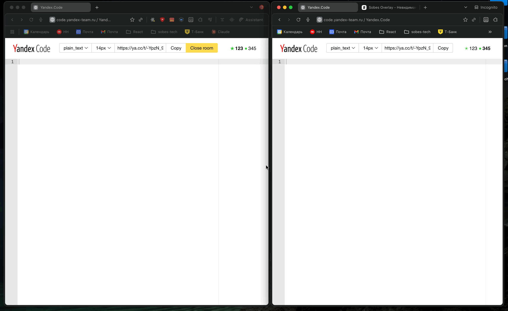

> 📄 [English version](./README-EN.md)

---

# 🛡️ Sobes Focus Blocker

**Chrome-расширение, которое блокирует слежку за фокусом и видимостью вкладки.**

Никаких всплывающих окон. Никаких настроек. Просто работает.

## 🧠 Что делает?

Расширение отключает JavaScript API, с помощью которых сайты отслеживают:

* Переключение вкладок (`visibilitychange`)
* Потерю фокуса (`blur`, `focus`)
* События окна (`window.onfocus`, `window.onblur`)
* Отслеживание активности пользователя в реальном времени

### 🚀 Дополнительные возможности:

* **Белый список сайтов** — добавляйте сайты-исключения, где расширение будет работать
* **Копирование текста** — позволяет копировать текст даже на сайтах, где это заблокировано

Работает на *всех сайтах*

## 💼 Кому пригодится?

* Участвуете в технических собеседованиях на платформах вроде **Yandex Code**
* Не хотите, чтобы сайты отслеживали вашу вкладку

## 🔧 Установка

1. [Скачайте архив](https://github.com/sobes-tech/focus-blocker/archive/refs/heads/main.zip)
2. Разархивируйте содержимое
3. Перейдите в `chrome://extensions/`
4. Включите режим разработчика (справа сверху)
5. Нажмите **«Загрузить распакованное расширение»** и выберите папку

## 📖 Как использовать

### Копирование текста на страницах

Расширение автоматически разблокирует возможность копирования текста на всех сайтах. Для копирования элементов:

1. Удерживайте `Ctrl` (или `Cmd` на Mac) и наведите курсор на нужный элемент — он подсветится синей рамкой
2. Нажмите `Ctrl+Alt` (или `Cmd+Alt` на Mac), чтобы скопировать весь текст выделенного элемента
3. Текст будет скопирован в буфер обмена

### Настройка белого списка

Если вы хотите включить расширение на нужных сайтах, добавьте их в белый список:

1. Нажмите на иконку расширения в панели браузера
2. В поле ввода укажите домен сайта на новой строке (например, `example.com`)

## 🧪 Совместимость

- **Браузеры**: Chrome 111+ (на базе Chromium)
- **Manifest**: V3
- **Сайты**: Все сайты

## 🧑‍💻 О нас

[Sobes.tech](https://sobes.tech) — инструмент для подготовки к собеседованиям с помощью нейросетей.
Приложение остаётся невидимым при шеринге экрана, слушает голос собеседника и помогает отвечать в реальном времени.
